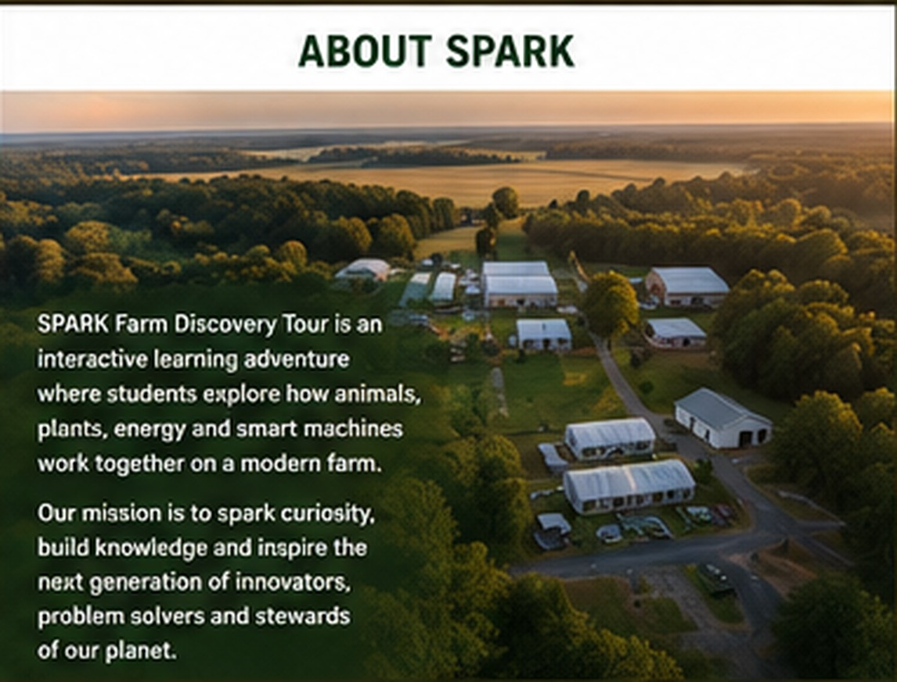

# About the SPARK Farm Discovery Tour

{ .spark-page-image loading=lazy }

## Mission

The SPARK Farm Discovery Tour helps young learners see that agriculture is a living engineering system. Animals, plants, water, energy, electronics, machines, and people all contribute to producing food responsibly.

## What SPARK means

- **Science:** living systems, water quality, energy, motion, and observation
- **Practical Agriculture:** animals, food production, plant growing, and farm operations
- **Robotics:** sensors, controllers, motors, automation, and machine behavior
- **Knowledge:** asking questions, measuring results, and connecting ideas

## Educational approach

The program emphasizes:

- Clear cause and effect
- Visible systems and labeled flows
- Prediction before demonstration
- Real equipment rather than isolated toys
- Safety, animal welfare, and environmental responsibility
- A progression from observation to future hands-on learning

## The four-station promise

Every visit gives students four different perspectives:

1. **Observe:** cameras, drones, and animal behavior
2. **Sustain:** aquaponics and renewable energy
3. **Automate:** programming, sensors, and robots
4. **Regenerate:** chickens, compost, worms, and hydroponics

## Organization information

Replace this section with the farm's history, memorial or founding story, operator biographies, partners, and community purpose.

**Organization:** [SPARK Farm Discovery Tour / farm legal name]  
**Location:** [City, Virginia]  
**Founded:** [Year]  
**Contact:** [Email and phone]
