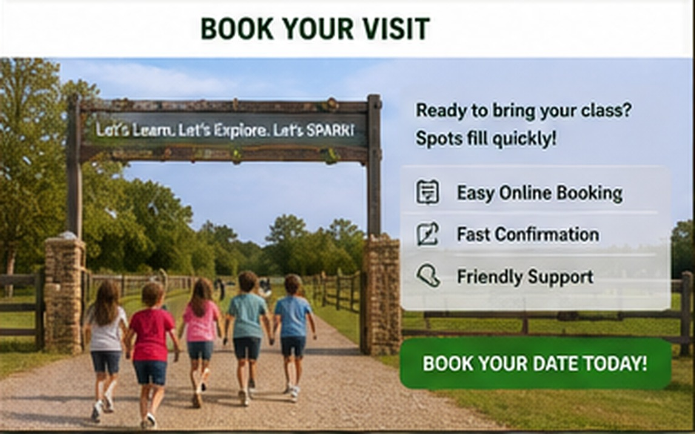

# Book a School Visit

{ .spark-page-image loading=lazy }

Use this page as the public inquiry and reservation starting point. Replace the placeholders below before publishing.

## Program summary

- **Program:** SPARK Farm Discovery Tour
- **Recommended grades:** 2–6
- **Duration:** 2 hours
- **Initial capacity:** up to approximately 40 students
- **Format:** four rotating demonstration stations
- **Location:** [Farm name and city]
- **Availability:** [Days and seasonal dates]
- **Price:** [Per-student price and minimum booking]

## Request information

Prepare the following details:

- School name
- Teacher or coordinator name
- Email and phone
- Grade level
- Preferred dates
- Student count
- Teacher and chaperone count
- Number of buses
- Requested arrival time
- Lunch-area request
- Accessibility and accommodation needs
- Special curriculum interests

## Contact

- **Email:** [hello@example.com](mailto:hello@example.com)
- **Phone:** [(804) 555-0123](tel:+18045550123)
- **Website:** [https://example.com](https://example.com)
- **Mailing address:** [Farm address]

## Before a reservation is confirmed

The program coordinator will verify the date, group size, staffing, bus plan, accessibility needs, pricing, deposit terms, weather policy, and required school documentation.

## Suggested booking policy placeholders

!!! note
    Replace these examples with reviewed operating policies before accepting reservations.

- Reservation held after signed agreement and deposit.
- Final attendance count due a specified number of business days before the visit.
- School provides emergency contacts and relevant accommodation information.
- Weather postponement and cancellation terms appear in the booking agreement.
- Late arrival may shorten the program.
