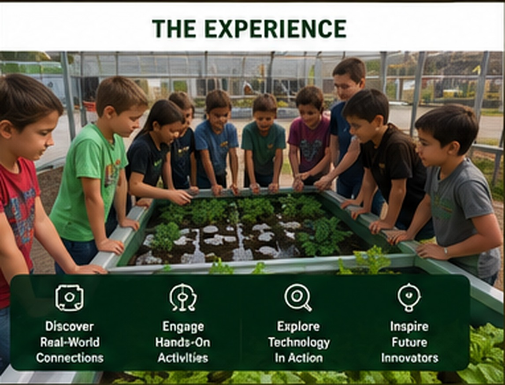

# The Two-Hour Experience

{ .spark-page-image loading=lazy }

## Program theme

> **Discover how animals, plants, energy, and machines work together.**

The SPARK Farm Discovery Tour is organized as four rotating demonstration stations. It is intentionally fast-moving and visual. Students participate through observation, prediction, measurement, simple decisions, and short guided activities rather than a full workshop at each station.

## Learning objectives

By the end of the visit, students should be able to:

- Explain how cameras and drones can support agricultural observation.
- Describe how fish, bacteria, water, and plants interact in aquaponics.
- Identify solar, wind, and human-generated electricity.
- Explain why a battery is needed when renewable energy is intermittent.
- Describe how a sensor, program, and motor form a smart machine.
- Explain how chickens, compost, and worms contribute to a circular farm.
- Compare four common hydroponic growing methods.
- Recognize that modern agriculture combines biology, engineering, and technology.

## Standard itinerary

| Time | Activity |
|---|---|
| 0:00–0:10 | Arrival, welcome, safety orientation, and group assignment |
| 0:10–0:30 | Rotation 1 |
| 0:30–0:35 | Transition |
| 0:35–0:55 | Rotation 2 |
| 0:55–1:00 | Transition |
| 1:00–1:20 | Rotation 3 |
| 1:20–1:25 | Transition |
| 1:25–1:45 | Rotation 4 |
| 1:45–2:00 | Connected Farm Challenge and closing review |

## Rotation model

Students are divided into four approximately equal groups before the first rotation.

| Group | Rotation 1 | Rotation 2 | Rotation 3 | Rotation 4 |
|---|---|---|---|---|
| Green | Station 1 | Station 2 | Station 3 | Station 4 |
| Blue | Station 2 | Station 3 | Station 4 | Station 1 |
| Yellow | Station 3 | Station 4 | Station 1 | Station 2 |
| Red | Station 4 | Station 1 | Station 2 | Station 3 |

## Closing: Connected Farm Challenge

Students reunite and arrange concept cards to create working connections such as:

- Solar panel → battery → pump → aquaponics
- Sensor → computer → decision → motor
- Chicken → manure and bedding → compost → garden
- Food scraps → worms → castings → soil
- Fish → waste → bacteria → plant nutrients
- Camera → wireless signal → display

The closing activity helps students see the farm as one system rather than four unrelated stations.

## Grade-level adaptation

=== "Grades 2–3"

    - Use concrete words, visible cause-and-effect, and shorter explanations.
    - Focus on animal and plant needs, simple cycles, measurement, and prediction.
    - Use picture cards and physical sorting activities.

=== "Grades 4–5"

    - Add energy conversion, nutrient cycles, sensor thresholds, and comparative growing methods.
    - Introduce power versus energy and basic program logic.

=== "Grade 6"

    - Add system constraints, reliability, feedback, automation, data, and tradeoffs.
    - Discuss why farms need backup power, calibration, and safety procedures.

!!! note "Demonstration first"
    The field trip is an introduction. Follow-on workshops provide the time required for students to wire circuits, write programs, test water, build hydroponic systems, or operate robots in greater depth.
