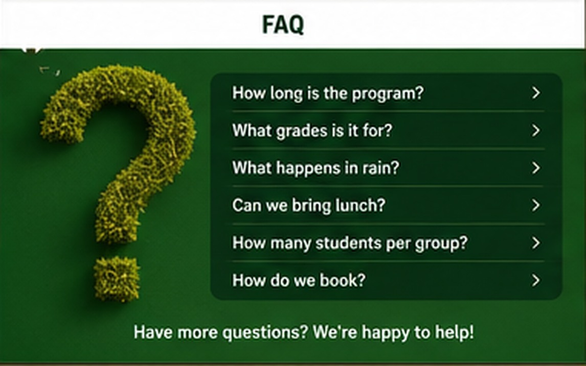

# Frequently Asked Questions

{ .spark-page-image loading=lazy }

## What grades is the program designed for?

The standard program is designed for Grades 2–6. Vocabulary, questions, measurements, and system detail are adjusted for the grade level.

## How long is the field trip?

The core program lasts two hours, including orientation, four rotations, transitions, and a closing activity. Lunch and extended workshops require additional reserved time.

## How many students can attend?

The recommended initial capacity is approximately 32–40 students. A larger two-bus program requires additional staffing and split activities at each station.

## Is the program hands-on?

It is a demonstration-centered experience with controlled participation. Students predict, measure, sort, pedal, inspect, and make decisions. Full building and programming activities are offered through follow-on workshops.

## Will the drone always fly?

No. Live flight depends on weather, wind, equipment condition, operational requirements, and animal behavior. Recorded mission footage and indoor component activities are available as substitutes.

## Do students touch the animals?

Animal contact is limited and supervised. The program focuses on observation, welfare, behavior, and farm systems rather than unrestricted petting.

## Is lunch included?

Lunch is not included in the standard two-hour program. A lunch period and covered eating area may be arranged in advance.

## What should students wear?

Closed-toe shoes and weather-appropriate outdoor clothing are required. Avoid sandals and loose clothing around equipment.

## What happens in rain?

Many activities can operate under cover. Drone flight and exposed equipment may be replaced with sheltered demonstrations and recorded material.

## Are accommodations available?

Yes. Schools should provide accessibility, sensory, allergy, medical, learning, and language-support information during booking so the visit can be planned appropriately.

## Are the vegetables or eggs served to students?

Food tasting or distribution is not part of the standard program unless specifically planned with appropriate handling procedures and school approval.

## Can families or homeschool groups attend?

The same four-station concept can be offered through scheduled family days, homeschool sessions, youth groups, workshops, and camps.
