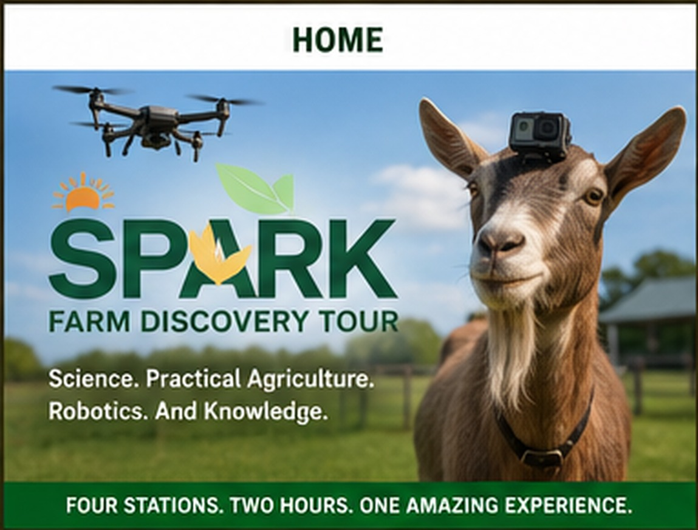

---
hide:
  - navigation
  - toc
---

Grades 2–6 · Two-hour field trip

# Where farming meets technology

Students explore animals, aquaponics, renewable energy, robotics, composting, worms, and hydroponics through four connected discovery stations.

[Explore the experience](experience.md){ .md-button .md-button--primary }
[Plan a school visit](booking.md){ .md-button }

{ .spark-page-image .spark-home-image loading=eager }

  
<strong>4</strong> discovery stations

  
<strong>120</strong> engaging minutes

  
<strong>2–6</strong> recommended grades

  
<strong>40</strong> initial group capacity

## Four stations. One connected farm.

  <article class="spark-card" markdown>
  1

  ### Goat-Cam Drone Mission

  Compare an aerial drone view with a live goat-level camera while exploring animal behavior, wireless video, and responsible agricultural technology.

  [Visit Station One →](stations/goat-cam-drone-mission.md)
  </article>

  <article class="spark-card" markdown>
  2

  ### Power the Food Cycle

  Follow water through aquaponics and see solar, wind, and bicycle power charge a battery that runs pumps, aeration, sensors, and lights.

  [Visit Station Two →](stations/power-the-food-cycle.md)
  </article>

  <article class="spark-card" markdown>
  3

  ### Smart Machines Discovery Lab

  Watch sensors, Arduino, Raspberry Pi, a robot car, and a desktop robot arm demonstrate how code becomes physical action.

  [Visit Station Three →](stations/smart-machines.md)
  </article>

  <article class="spark-card" markdown>
  4

  ### Eggs, Worms & Water Gardens

  Explore layer hens, egg production, composting, vermiculture, Kratky, DWC, vertical gardening, and Dutch-bucket hydroponics.

  [Visit Station Four →](stations/eggs-worms-water-gardens.md)
  </article>

## The SPARK idea

**SPARK** brings together **Science, Practical Agriculture, Robotics, and Knowledge**. Students do not encounter isolated exhibits; they discover how living systems, energy, code, machines, and people work together.

## Designed for school groups

:material-clock-outline: **Two-hour structure:** welcome, four 20-minute rotations, transitions, and a closing Connected Farm Challenge.

:material-school-outline: **Teacher-friendly:** pre-visit guidance, grade-adjustable explanations, curriculum connections, and clear group rotation plans.

:material-weather-partly-cloudy: **Weather-aware:** covered demonstrations and substitute activities are planned when drone flight or outdoor activities are unsafe.

:material-lightbulb-on-outline: **A gateway to deeper learning:** workshops and camps can extend robotics, aquaponics, hydroponics, and renewable-energy topics.

## Bring your class into the system

Students will leave understanding that modern farming is not only about planting and harvesting. It combines biology, animal care, water, energy, sensors, programming, engineering, and human creativity.

[Review teacher information](teachers.md) · [Book a visit](booking.md)

