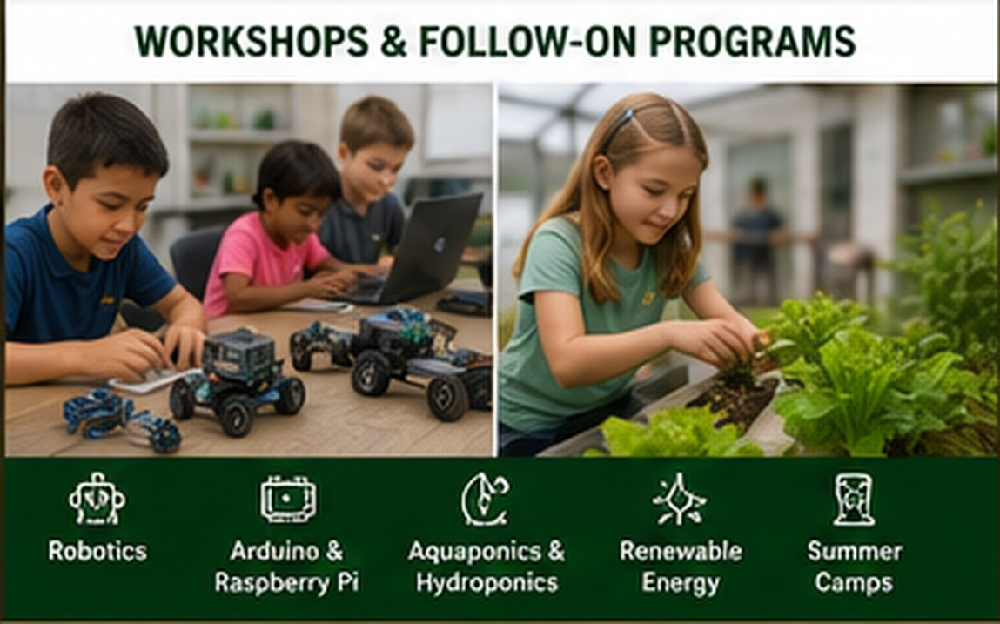

# Learning Pathways

{ .spark-page-image loading=lazy }


The two-hour field trip is an introduction. Interested students, families, schools, and youth organizations can return for longer programs built around the same equipment.

## Robotics and programming

- Arduino beginner workshop
- Raspberry Pi project lab
- Obstacle-avoiding robot-car build
- IMU, roll, pitch, and yaw visualization
- Servo motion and self-leveling platforms
- Desktop manufacturing-robot programming
- Computer vision and object sorting

## Agriculture and water systems

- Build a small Kratky garden
- DWC aeration and root-health lab
- Vertical-garden design
- Dutch-bucket tomatoes or peppers
- Aquaponics water-quality workshop
- Fish, bacteria, and plant nutrient cycles

## Renewable energy

- Solar panel measurement
- Wind-energy investigation
- Bicycle-generator challenge
- Battery capacity and critical-load planning
- Smart monitoring with sensors and dashboards

## Circular farm skills

- Layer-hen care
- Egg handling and candling
- Compost recipe and temperature monitoring
- Red-wiggler vermiculture
- Soil amendment and plant trials

## Possible program formats

| Format | Typical length | Best use |
|---|---:|---|
| Introductory workshop | 60–90 minutes | One focused concept |
| Half-day lab | 3 hours | Build, test, and revise |
| Full-day program | 5–6 hours | Multi-stage project |
| Multi-week club | 6–10 sessions | Programming and engineering progression |
| Summer camp | 3–5 days | Integrated SPARK projects |

## Student progression

```text
See it → Understand it → Build it → Program it → Improve it → Explain it
```
