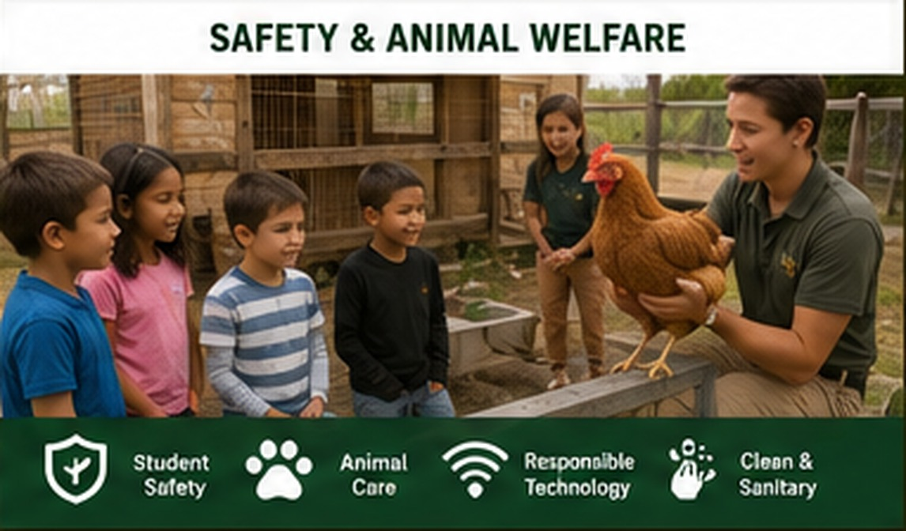

# Safety & Accessibility

{ .spark-page-image loading=lazy }

## Student expectations

Students must:

- Stay with their assigned group.
- Walk between stations.
- Remain behind marked barriers.
- Follow instructor directions immediately.
- Avoid touching animals or equipment without permission.
- Keep hands outside robot and electrical enclosures.
- Stay outside the drone operating area.
- Wash or sanitize hands after animal and compost activities.
- Avoid eating during animal, worm, and compost demonstrations.

## Drone safety

- The planned flight path does not cross above students.
- The pilot and launch area are physically separated from visitors.
- The demonstration uses weather and wind limits.
- Live flight may be replaced by recorded footage at any time.
- Feed is not dropped from a hovering drone.

## Robot and electrical safety

- Robot arms operate behind a clear guard or enclosure.
- Moving belts, chains, gears, and bicycle-generator components are guarded.
- Low-voltage DC equipment is preferred around public water displays.
- Batteries, controllers, and terminals are secured in locked enclosures.
- Any required AC equipment uses appropriate ground-fault protection.
- Emergency-stop controls are accessible to staff.

## Animal welfare and hygiene

- Animals are selected and managed for calm public demonstrations.
- Sessions are limited when animals show stress.
- Students do not chase, corner, feed, or touch animals unless a supervised activity explicitly permits it.
- Handwashing or sanitizer is required after animal contact areas.
- Food and beverages remain outside animal and compost zones.

## Aquaponics safety

- Fish-life-support systems include automatic backup power and emergency aeration.
- Visitors are separated from pumps, electrical connections, and open water.
- Floors and paths are designed to reduce slipping.
- Water testing uses age-appropriate procedures and staff supervision.

## Accessibility planning

Notify the program before the visit regarding:

- Mobility and route-access needs
- Sensory considerations
- Allergies
- Medical concerns
- Learning accommodations
- Language support
- Other student-specific needs

Program materials can be adapted through larger print, visual schedules, reduced-noise positioning, additional transition time, seated viewing, and alternate participation methods when arranged in advance.

## Weather plan

Most demonstrations are outdoors or in covered agricultural spaces. Light rain may not cancel the program, but drone flight and exposed electrical demonstrations can be suspended.

Substitute activities include:

- Recorded drone mission and live Goat-Cam viewing
- Drone component inspection and mission planning
- Tabletop renewable-energy demonstrations
- Sensor and robot activities under cover
- Root, compost, worm, and egg exhibits in sheltered areas
