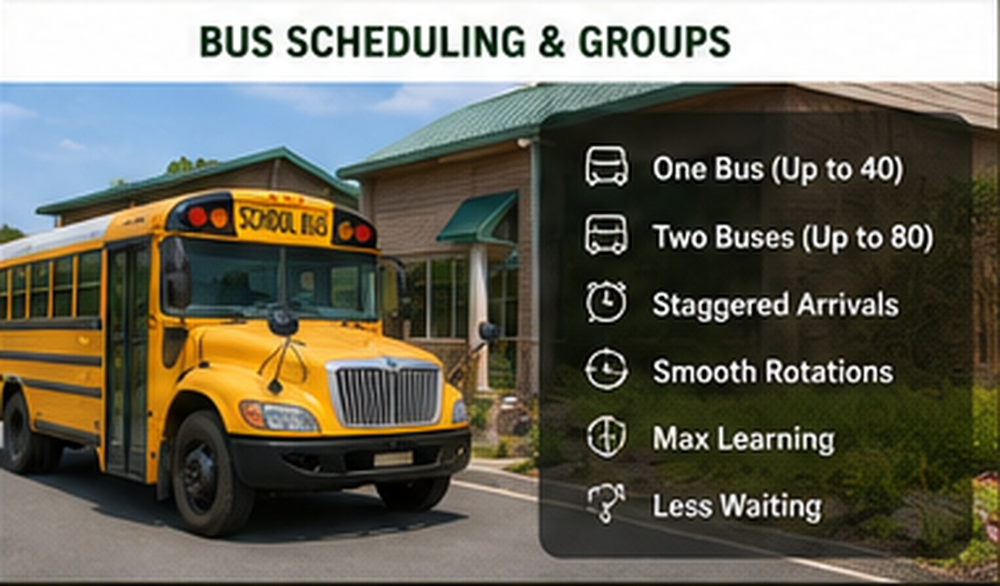

# Scheduling & Group Capacity

{ .spark-page-image loading=lazy }

## Recommended launch capacity

Start with one bus or one cohort of up to approximately 40 students. This places about 8–10 students at each station and preserves visibility, interaction, and safe movement.

| Operating level | Students | Typical buses | Operating requirement |
|---|---:|---:|---|
| Initial | 32–40 | 1 | One leader at each station plus coordinator |
| Expanded | 64–80 | 2 | Two subgroups per station and additional assistants |
| Mature | 120–160 per day | 3–4 | Two separate program waves or duplicated station capacity |

## Two-bus model

Two buses may attend one program when students are divided into eight subgroups:

- Green 1 and Green 2
- Blue 1 and Blue 2
- Yellow 1 and Yellow 2
- Red 1 and Red 2

At each station, one subgroup begins with the primary demonstration while the other begins with a supporting activity. They switch halfway through.

### Example station splits

| Station | Subgroup A | Subgroup B |
|---|---|---|
| Goat-Cam | Live viewing and animal behavior | Drone components and mission planning |
| Aquaponics | Water and fish cycle | Bicycle generator and energy dashboard |
| Smart Machines | Robot car and IMU | Robot arm and programming display |
| Circular Farm | Chickens, compost, and worms | Hydroponics and root investigation |

## Staggered arrival

Buses may arrive 10–15 minutes apart to reduce congestion during unloading, restroom use, and grouping. The formal station rotations should normally begin after both cohorts complete orientation.

## Four-bus day

Use two waves instead of placing four buses into the stations simultaneously.

| Wave | Example window |
|---|---|
| Morning | 9:00–11:00 |
| Reset and lunch | 11:00–12:00 |
| Afternoon | 12:00–2:00 |

Exact start times should be coordinated with school bell schedules, travel time, lunch, and return requirements.

## Why not four buses at once?

A simultaneous four-bus arrival can create 35–50 students per station, reducing visibility and increasing noise, animal stress, restroom lines, transition time, and supervision requirements. Separate waves protect the quality of the educational experience.

## Staffing guide

| Role | Initial one-bus program | Expanded two-bus program |
|---|---:|---:|
| Program coordinator | 1 | 1 |
| Station leaders | 4 | 4 |
| Station assistants | 0–1 | 4 |
| Floater / safety support | 1 recommended | 1–2 |
| Total recommended staff | 5–6 | 10–11 |

!!! tip "Build capacity gradually"
    Run several one-bus visits before accepting two buses in one wave. Measure transition time, noise, restroom demand, equipment resets, and animal response before increasing capacity.
