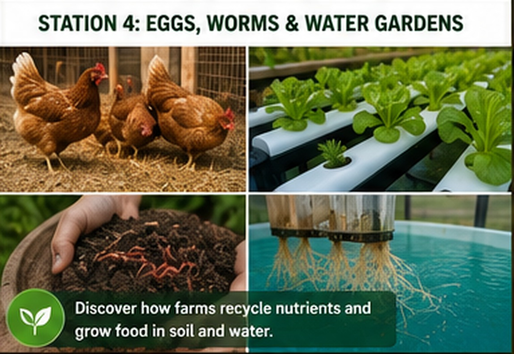

# Station 4: Eggs, Worms & Water Gardens

{ .spark-page-image loading=lazy }


**Tagline:** *Recycle nutrients. Grow food. Waste less.*

## What students discover

This station compares a living-soil cycle with several soilless growing systems.

```text
Chicken feed → eggs + manure → compost → soil → crops
```

```text
Water + measured nutrients → plant roots → hydroponic vegetables
```

## Demonstration flow

| Minutes | Activity |
|---|---|
| 1–4 | Layer hens: feed, water, nesting boxes, roosts, bedding, and eggs. |
| 5–8 | Compost sorting and temperature demonstration. |
| 9–12 | Worm-bin observation and castings. |
| 13–18 | Compare Kratky, DWC, vertical gardening, and Dutch buckets. |
| 19–20 | Soil-or-water crop challenge. |

## From feed to egg

Students identify the basic resources a layer hen needs and follow the path from feed to egg. Replica eggs can be used for handling, sorting, and math activities.

## Compost: nature's recycling factory

Students classify clean examples or picture cards:

- **Greens:** fresh plant matter and selected food scraps
- **Browns:** dry leaves, straw, and plain cardboard
- **Keep out:** plastic, glass, metal, and unsuitable materials

A compost thermometer shows that decomposition releases heat.

## Vermiculture

A protected observation panel reveals red wigglers, bedding, decomposing material, cocoons, and castings. Students compare unfinished material with the finished soil amendment.

## Four hydroponic methods

| Method | Main feature | Demonstration crop |
|---|---|---|
| Kratky | Passive; no circulation pump | Lettuce |
| Deep-water culture | Roots suspended above aerated nutrient water | Lettuce or basil |
| Vertical garden | Uses height to grow more plants in a small footprint | Herbs and greens |
| Dutch bucket | Individual containers support larger plants | Tomato, pepper, or cucumber |

A removable net cup lets students see a complete root system.

!!! important "Keep manure out of hydroponic reservoirs"
    Raw chicken manure is not added directly to Kratky, DWC, vertical, or Dutch-bucket systems. These systems use a clean, measured nutrient solution. Manure and compost belong in the managed soil-building pathway.

## Follow-on pathway

- Backyard chicken care
- Compost and worm workshop
- Build a Kratky container
- DWC and aeration lab
- Vertical garden build
- Dutch-bucket growing class
