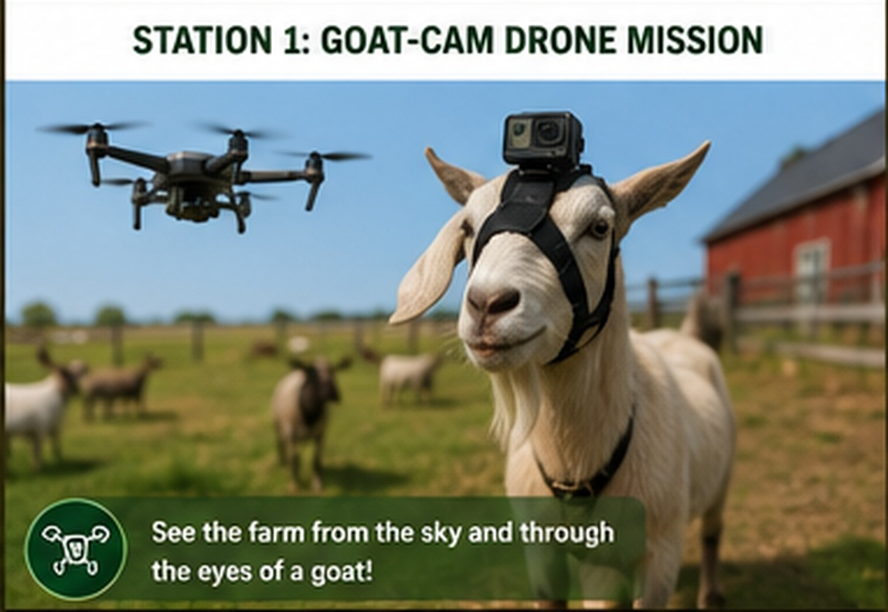

# Station 1: Goat-Cam Drone Mission

{ .spark-page-image loading=lazy }

**Tagline:** *See the farm from the sky—and through the eyes of a goat.*

## What students discover

- Aerial and ground-level perspectives reveal different information.
- Wireless cameras transmit video to a screen.
- Animal behavior can be observed without students entering the herd area.
- Technology must be used with safety and animal welfare in mind.

## Demonstration flow

| Minutes | Activity |
|---|---|
| 1–3 | Meet the camera goat and observe the live feed. |
| 4–6 | Identify drone components and compare viewpoints. |
| 7–12 | Watch a controlled drone mission along a predetermined route. |
| 13–16 | Observe the herd using the live Goat-Cam and fixed viewing area. |
| 17–20 | Discuss which viewpoint revealed the most useful information. |

## Preventing an unwanted food association

The drone is not the goats' feeding signal. Feed is released from a protected ground station only after a separate bell, light, or other established cue. Routine non-feeding drone flights help the herd treat the aircraft as background farm equipment.

## What students can do

- Predict which goat will react first.
- Compare the drone, goat, and human viewpoints.
- Identify what the drone can see from above.
- Identify what the Goat-Cam reveals at animal height.
- Review a short replay and describe herd behavior.

## Technology on display

- FPV or wireless video
- Action camera and safe breakaway harness
- Drone camera and controller
- Fixed observation camera
- Video switching or split-screen display
- Optional computer-vision goat counting

## Safety design

- The drone never flies above students.
- Students remain behind a marked viewing boundary.
- The pilot area and landing pad are physically separated.
- A visual observer supports the qualified pilot.
- Weather, wind, equipment condition, and animal behavior are checked before flight.
- A recorded mission replaces live flight when conditions are unsuitable.

## Follow-on pathway

Students can return for a drone-mission planning workshop, camera systems lab, animal behavior activity, or introductory computer-vision session.
