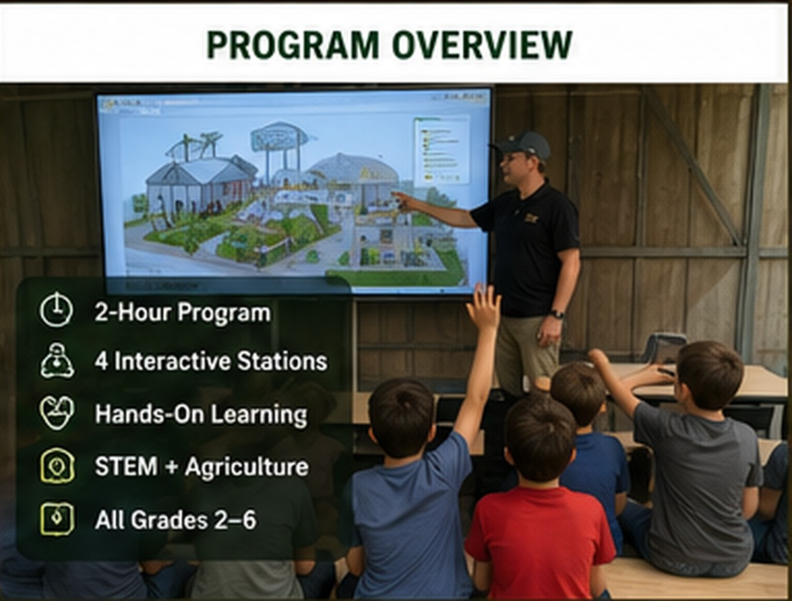

# Station Overview

{ .spark-page-image loading=lazy }

Each station answers a different question, but all four support the same theme: **How do living systems and engineered systems work together?**

| Station | Central question | Signature moment |
|---|---|---|
| Goat-Cam Drone Mission | How can cameras and drones help us observe animals? | Students see the herd from the goat's viewpoint. |
| Power the Food Cycle | How do biology and renewable energy keep an aquaponics system alive? | Pedaling activates visible aeration or water flow. |
| Smart Machines Discovery Lab | How does code make a machine respond to the world? | A robot detects an obstacle or sorts an object. |
| Eggs, Worms & Water Gardens | How can a farm produce food while recycling resources? | Students uncover worms and inspect hydroponic roots. |

## The connected learning sequence

  
Observe the farm

  
Follow energy and water

  
See code control machines

  
Recycle nutrients

  
Connect the whole system

## Station design principles

- **Visible systems:** important water, energy, sensor, and nutrient flows are labeled.
- **Short feedback loops:** students see an immediate response to pedaling, tilting, sensing, or sorting.
- **Safe participation:** students make predictions and controlled choices without entering equipment zones.
- **Repeatable operation:** each station follows a reliable 20-minute presentation plan.
- **Expandable learning:** every station points toward a longer workshop or camp.
