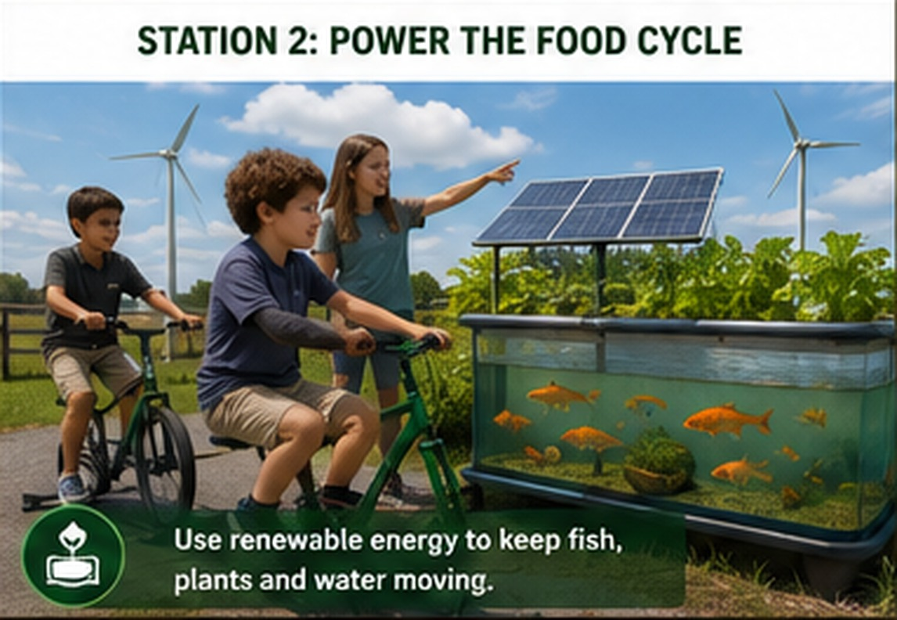

# Station 2: Power the Food Cycle

{ .spark-page-image loading=lazy }


**Tagline:** *Pedal. Pump. Grow.*

## What students discover

This station combines two cycles:

1. **Biology:** fish waste → beneficial bacteria → plant nutrients → cleaner water.
2. **Energy:** solar + wind + bicycle power → battery → pump + aeration + sensors + lights.

## Demonstration system

A food-safe IBC tote is cut horizontally. The deeper lower section serves as the fish tank; the shallow upper section becomes the plant grow bed. Water is pumped upward, moves through the plant roots, and returns by gravity.

```text
Fish tank → pump → grow bed → drain → fish tank
```

## Demonstration flow

| Minutes | Activity |
|---|---|
| 1–4 | Follow the water through fish tank, pump, plants, and return drain. |
| 5–7 | Identify solar, wind, bicycle, battery, and electrical loads. |
| 8–12 | Pedal-power challenge with a live wattage display. |
| 13–16 | Observe a water-quality measurement. |
| 17–20 | Decide which loads remain powered when battery energy is limited. |

## The pedal-power moment

Students see power and energy translated into a useful outcome:

> “Your pedaling generated enough energy for additional aeration.”

A dashboard can display:

- Current bicycle power in watts
- Energy generated in watt-hours
- Battery state of charge
- Current solar and wind production
- Estimated pump or aeration time supported

## Critical-load challenge

Students place the loads in priority order:

1. Aeration
2. Water circulation
3. Monitoring and alarms
4. Grow lights
5. Decorative lighting or waterfall

This introduces reliability and engineering tradeoffs.

## What students can measure

- Water temperature
- pH
- Dissolved oxygen
- Nitrate
- Water level
- Flow status
- Battery percentage

!!! warning "Life-support backup"
    Fish safety cannot depend on sunshine, wind, or student pedaling. The operational system needs automatic backup power and independent emergency aeration.

## Follow-on pathway

Students can return for aquaponics, renewable-energy, water testing, battery monitoring, or smart-farm sensor workshops.
