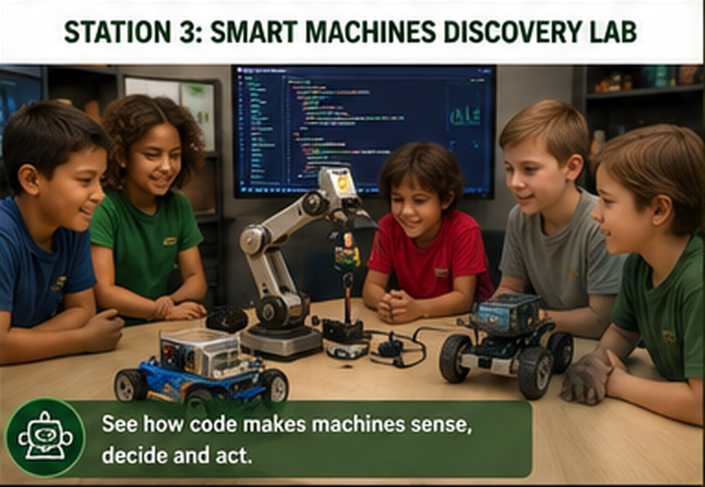

# Station 3: Smart Machines Discovery Lab

{ .spark-page-image loading=lazy }


**Tagline:** *See how code makes machines sense, decide, and act.*

## The unifying idea

```text
SENSE → PROCESS → DECIDE → ACT
```

- A **sensor** measures the environment.
- Arduino or Raspberry Pi **processes** the measurement.
- A program **decides** what should happen.
- A light, motor, robot, pump, or alarm **acts**.

## Demonstration flow

| Minutes | Activity |
|---|---|
| 1–4 | Sensor demonstration: distance, light, temperature, motion, and orientation. |
| 5–10 | Robot Road Challenge with an obstacle-avoiding car. |
| 11–16 | Mini Smart Factory with a desktop robot arm. |
| 17–20 | Programming preview and invitation to deeper workshops. |

## IMU demonstration

A physical IMU is rotated while a Python display shows:

- Roll
- Pitch
- Yaw

Students see motion become numbers and can watch a virtual object follow the sensor.

## Robot Road Challenge

A small robot car:

1. Moves forward.
2. Measures distance.
3. Detects an obstacle.
4. Stops or reverses.
5. Turns toward a clearer route.
6. Continues through the course.

The screen displays live messages such as:

```text
Distance: 34 cm
Obstacle detected
Reversing
Turning right
```

## Mini Smart Factory

A desktop robot arm performs a manufacturing-style task:

1. Detect an object.
2. Pick it up.
3. Move through a programmed path.
4. Sort it by color or category.
5. Place it in the correct bin.
6. Return home.

## Programming preview

```python
if distance_cm < 20:
    stop()
    reverse()
    turn_right()
```

Students do not need to write a complete program during the field trip. The goal is to recognize that changing an instruction changes machine behavior.

## What students can do

- Place a safe foam obstacle.
- Predict the car's next move.
- Select a stopping-distance threshold.
- Rotate the IMU and compare angles.
- Choose the robot arm's destination bin.

## Follow-on pathway

- Arduino beginner lab
- Raspberry Pi project workshop
- Robot-car build
- IMU and motion-control lab
- Computer vision and AI
- Farm automation
