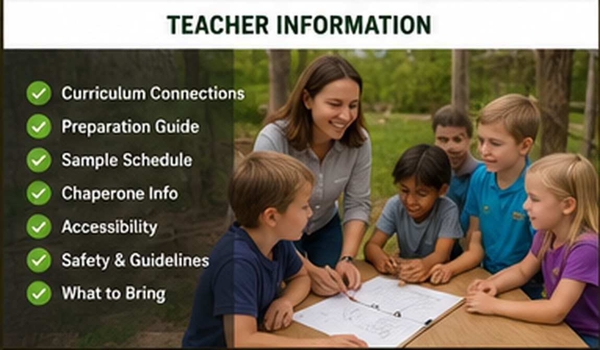

# Teacher Information

{ .spark-page-image loading=lazy }

## Before the visit

Teachers may introduce:

- Basic needs of plants and animals
- Renewable and nonrenewable energy
- Recycling and decomposition
- Sensors and programmed instructions
- The difference between soil and soilless growing

Encourage students to prepare one question about farming, animals, energy, robots, or food production.

## Group preparation

Before arrival, divide the class into four approximately equal groups:

- Green
- Blue
- Yellow
- Red

Assign at least one teacher or chaperone to each group. Color-coded name tags or wristbands are helpful.

## Recommended chaperone ratios

| Grade | Recommended ratio |
|---|---:|
| Grades 2–3 | 1 adult per 6 students |
| Grades 4–6 | 1 adult per 8 students |

## Clothing

Students should wear:

- Closed-toe shoes
- Comfortable outdoor clothing
- Weather-appropriate layers
- Sun protection when needed

Students may bring a refillable water bottle and a packed lunch when lunch arrangements are included.

## Arrival

Plan to arrive approximately 10 minutes before the program start.

1. Remain on the bus until greeted by staff.
2. Follow the designated unloading route.
3. Assemble in the orientation area.
4. Confirm attendance and group assignments.
5. Review farm and equipment safety rules.

Late arrivals may require shortened station rotations.

## Curriculum connections

The experience supports instruction in:

- Animal behavior and life science
- Plant structure and nutrition
- Ecosystems and nutrient cycles
- Energy conversion and storage
- Water conservation
- Engineering design
- Sensors, measurement, and data
- Robotics and automation
- Programming logic
- Waste reduction and recycling
- Practical mathematics
- Agriculture and food systems

## Lunch

Lunch is not included in the standard two-hour program unless arranged in advance. Schools requesting a lunch period should reserve the covered eating area and add sufficient time to the visit.

## Required school information

Provide these details before the visit:

- School and grade level
- Student, teacher, and chaperone counts
- Bus count and expected arrival time
- Accessibility requirements
- Allergies and medically relevant considerations
- Sensory or learning accommodations
- Emergency contact and school lead
